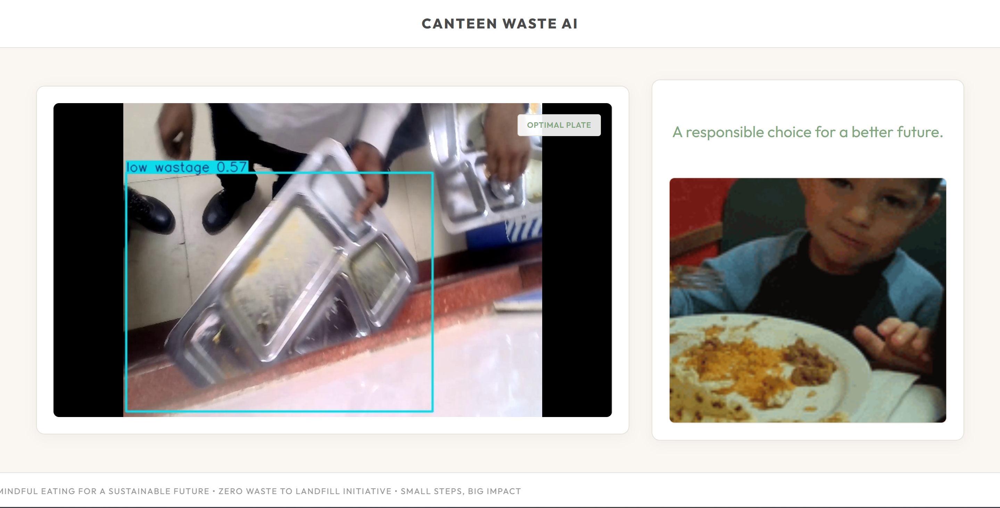
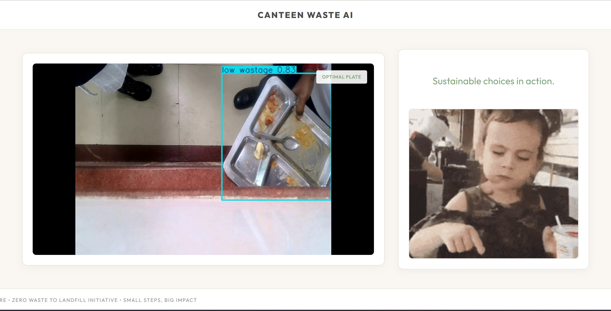

# 🍽️ Canteen Waste Management System

### Motto: **"0 Waste to Landfill"**

## 🚀 Overview
The **Canteen Waste Management System** is an AI-powered real-time monitoring solution designed to reduce food wastage. By leveraging Computer Vision (AI/ML), the system detects the level of food wastage on plates and provides dynamic feedback to users, encouraging mindful consumption.

## 🌟 Key Features
- **Real-time AI Detection**: Uses YOLOv8 (You Only Look Once) for fast and accurate food waste classification.
- **Dynamic Feedback Loop**:
  - **Low Wastage**: "Excellent! Your mindful consumption makes a difference." (Accelerated with positive visual reinforcement).
  - **Medium Wastage**: "Let’s improve — take only what you need."
  - **High Wastage**: "Excess waste detected. Please respect our food resources." (Accompanied by cautionary visuals).
- **Interactive UI**: A sleek web interface built with Flask and Vanilla JS for real-time video streaming and data reporting.
- **Sustainable Impact**: Directly aligns with the mission of **0 waste to landfill**.

## 📸 Screenshots
| Low Wastage - Positive Reinforcement | Responsible Choice Recognition |
|:---:|:---:|
|  |  |

> [!TIP]
> **"TAKE ALL YOU CAN EAT, BUT EAT ALL YOU TAKE."** — Our core principle for every meal.

## 🛠️ Tech Stack
- **Framework**: Flask (Python)
- **AI/ML Engine**: YOLOv8 (Ultralytics)
- **Computer Vision**: OpenCV
- **Frontend**: HTML5, CSS3, JavaScript (Vanilla)
- **Models**: `best.pt` (Custom trained YOLOv8 model)

## 🚶 Walkthrough
1. **Live Feed**: The system captures video from the canteen tray return area.
2. **AI Inference**: The YOLOv8 model processes each frame to detect the amount of food left on the plate.
3. **Data Classification**: Labels are categorized into `Low`, `Medium`, and `High` wastage.
4. **Instant Feedback**: The frontend periodically fetches the wastage data and updates the message and background visuals to inform the user about their choice.

## ⚙️ Installation & Usage
### 1. Requirements
Ensure you have Python installed, then run:
```bash
pip install -r requirements.txt
```

### 2. Setup
- Place your trained model as `best.pt` in the root directory.
- Update `VIDEO_PATH` in `app.py` to point to your camera or video file.

### 3. Run the Application
```bash
python app.py
```
Visit `http://127.0.0.1:5000` in your browser.

## 💡 Mission
Toward a sustainable future, one plate at a time. This project is a personal initiative to promote environmental responsibility and community values.

---
*Canteen Waste Management Initiative.*
